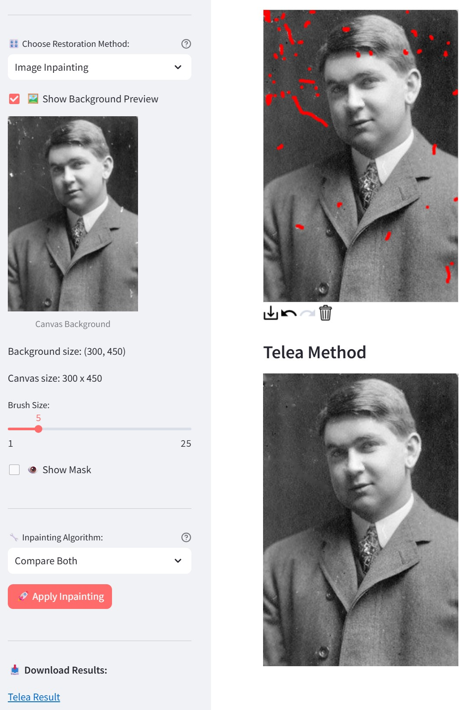
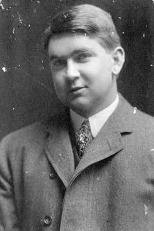
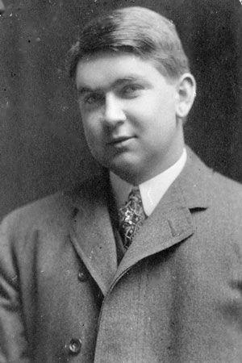

# 🖼️ Image Restoration App

<div align="center">


**Restore damaged photos with computer vision algorithms**

[](https://your-app-url.streamlit.app)
[](https://github.com/yourusername/image-restoration-app/stargazers)

</div>

---

## ✨ What It Does

Transform old or damaged photos using professional computer vision techniques through an intuitive web interface. Upload an image and choose from three powerful restoration methods:

- **🌪️ Median Blur**: Remove noise while preserving edges
- **🎯 Bilateral Filter**: Smooth textures while keeping details sharp  
- **🖌️ Interactive Inpainting**: Paint over unwanted objects or damage to remove them


### Main Interface


<table>
<tr>
<td width="50%">


### Before

</td>

<td width = "50%">

### After


</td>
</tr>
</table>

---

## 🚀 Quick Start

```bash
# Clone and install
git clone https://github.com/yourusername/image-restoration-app.git
cd image-restoration-app
pip install -r requirements.txt

# Run the app
streamlit run app.py
```

Open http://localhost:8501 and start restoring photos!

---

## 🛠️ Tech Stack

- **Streamlit** - Web interface and real-time updates
- **OpenCV** - Computer vision algorithms (median blur, bilateral filter, inpainting)
- **NumPy & Pillow** - Image processing and manipulation
- **streamlit-drawable-canvas** - Interactive drawing for inpainting masks

## 🎯 Key Features

✅ **Real-time preview** with adjustable parameters  
✅ **Interactive canvas** for precise inpainting mask creation  
✅ **Multiple algorithms** - Compare Telea vs Navier-Stokes inpainting  
✅ **Download results** in high quality  
✅ **Mobile responsive** design  
✅ **No installation needed** - runs in any web browser  

---

## 📸 Perfect For

- **Developers**: Showcase computer vision and web development skills
- **Photo enthusiasts**: Quick fixes for damaged family photos
- **Students**: Learn image processing algorithms with visual feedback

---

## 🤝 Contributing

Found a bug or have an idea? [Open an issue](https://github.com/yourusername/image-restoration-app/issues) or submit a pull request!

```bash
1. Fork the repo
2. Create feature branch: git checkout -b feature/amazing-feature
3. Commit changes: git commit -m 'Add amazing feature'
4. Push and create pull request
```

---

## 📄 License

MIT License - see [LICENSE](LICENSE) file for details.

---

<div align="center">

**⭐ If this helped restore a precious memory, give it a star! ⭐**

Made with ❤️ by [Your Name] | [Portfolio](https://yourwebsite.com) | [LinkedIn](https://linkedin.com/in/yourprofile)

</div>
